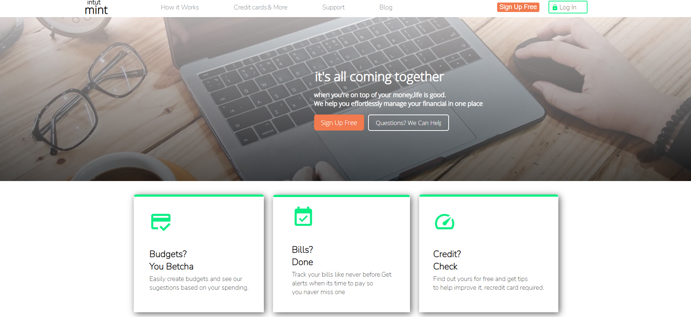

 # CREATION OF LANDING PAGE 2

 ## Welcome!

 ##let's get started.

 Thank you for checking this work.

 ## About This Work:
This work is created for the purpose of practising (HTML & CSS) complex flex-box and media queries for the purpose of ensuring effective layout of website, and other HTML templates.

## pictures of this Work
 ##An Example##

 ##process##
      THIS FILE IS FOR THE PRACTISE OF HTML(DEEPER)
 -PRACTISE FOR THE BUILDING OF MODERN SEMANTIC WEBSITE
 -STRUCTURES OF DIFFERENT ELEMENTS, MOSTLY BLOCK ELEMENTS.
 -PRACTISED THE USE OF PROPER MARKNG-UP  FOR BETTER RESULTS.

    THIS FILE IS FOR THE PRACTISE OF CSS
 -PRACTISED USING FLEX-BOX TO YIELD OUT A BEAUTIFUL LAYOUT OF SITE.
 -USED FLEXBOX TO CONTROL THE DISPLAY PATTERN TOO.
 -USED THE QUERY PROPERTIES(MEDIA) IN ENSURING SMOOTH LAYOUT WITH ALL CHECKPOINTS BEING MET.
 -IT'S ALSO RESPONSVE......

 ##Larger screen sizes##

 ##smaller screen sizes##

  ## Built with         
      -HTML(Hypertext Mark-up Language)
      -CSS(Cascading Styles Sheet)

  ## My Challanges and lessons
   Learnt how to re-size pictures with pixcels firstly, used my fontsizes well, Used my pixcels for nice elements that will remain permanent in size as the work goes on. HTML was fun working with.

   ## Installations
   -For those Farmiliar with Git-hub you can clone the repo and pull to your local workplace to view.
   
   -For those who want to check the work from the site, click here [https://app.netlify.com/sites/thirsty-mcnulty-889017], to view Thank you once again.
   
   -For those who want to view the first file, click here [https://jmp.sh/fvvdS8B], to view Thank you once again.
   
   -For those who want to view the second file, click here [https://jmp.sh/Jyd3LKY], to view Thank you once again.

   ## Best syntax Used

    ``CSS
   (queries(media)), (flex-box), and (power of proper font usage).
  Media queries is very important to practise building easy and responsive layout stuctures for all sections in the site. You will see them all around websites.
   ``

   ## Resources that helped ##
   -For the Colors[https://htmlcolorcodes.com/color-names/]

   -For the icons[https://fontawesome.com/v5.15/icons/instagram?style=brands] and svg's in the folder.

   -For the Fonts[https://fonts.google.com/]

   -For the images[https://unsplash.com/]

 ## Licsense 
   This work is under [MIT] liscence. It's highly free and opensource to anyone.

